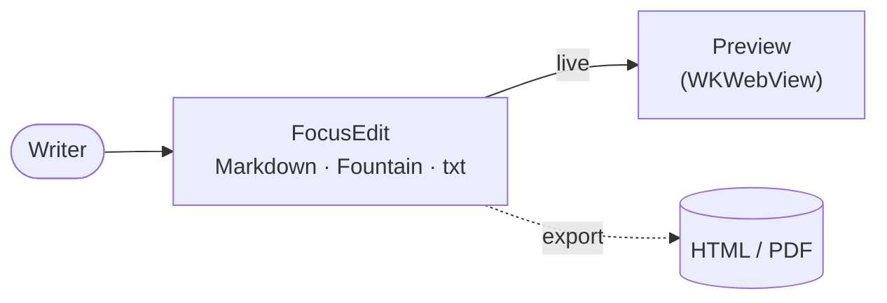
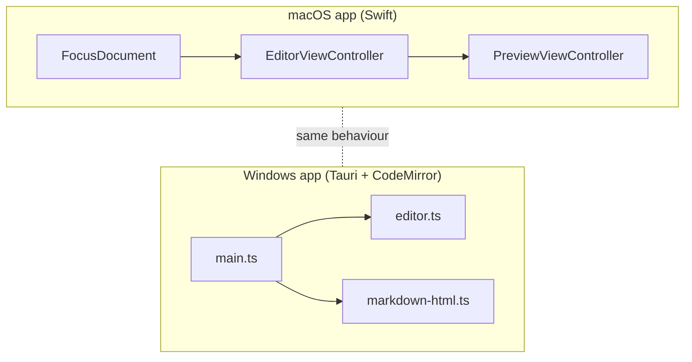
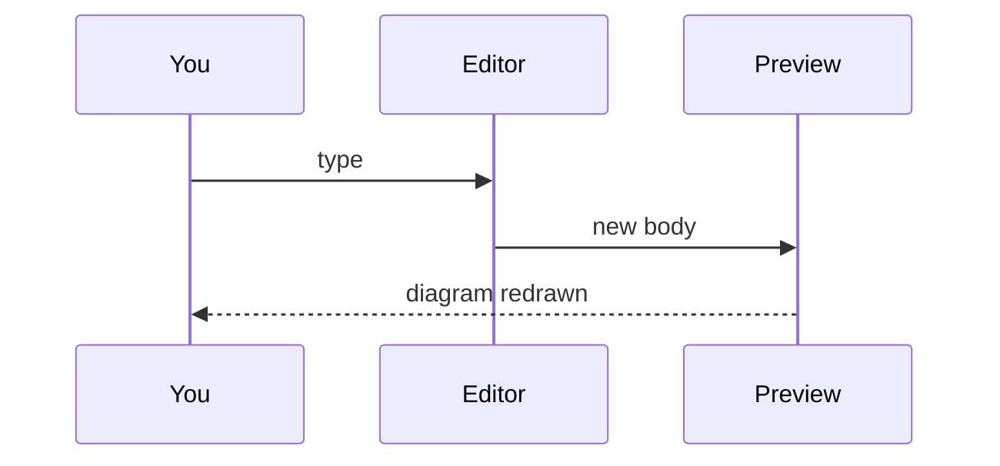

# Diagrams

A fenced block marked `mermaid` is drawn as a diagram in the preview (Split or Preview).
Hover it for − / Fit / +, ⌥-scroll or pinch to zoom, double-click to open it full size.

```mermaid
flowchart LR
    Writer(["Writer"])
    Editor["FocusEdit<br/>Markdown · Fountain · txt"]
    Preview["Preview<br/>(WKWebView)"]
    Export[("HTML / PDF")]

    Writer --> Editor
    Editor -- "live" --> Preview
    Editor -. "export" .-> Export
```

```mermaid
flowchart TB
    subgraph mac["macOS app (Swift)"]
        direction LR
        Doc["FocusDocument"] --> View["EditorViewController"]
        View --> Prev["PreviewViewController"]
    end
    subgraph win["Windows app (Tauri + CodeMirror)"]
        direction LR
        Main["main.ts"] --> Ed["editor.ts"]
        Main --> Html["markdown-html.ts"]
    end
    mac -. "same behaviour" .- win
```

```mermaid
sequenceDiagram
    participant U as You
    participant E as Editor
    participant P as Preview
    U->>E: type
    E->>P: new body
    P-->>U: diagram redrawn
```
